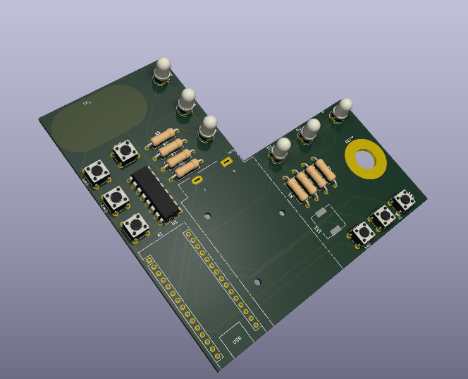

# pride-ocarina
An arduino nano based queer electronic ocarina
This was supposed to be used in a pride related workshop where I would spark curiosity with a little electronic soldering course.
The circuit do 2 things. First it has animated leds that shows queer flag colors with animation.
Second it's an electric ocarina based on the 6 holes kind.
It's engineered in a way that it's easy to understand and solder, not to be elegant.
The workshop hasn't been approved so I will keep this unfinished work for maybe a futur pride event.

Here is how it looks like at the moment:

## BOM
- 1 arduino nano
- 6 RGB lets
- 7 push buttons
- 1 9V battery with switch
- 2 double side sticker
- 1 100Ohm resistor
- 6 220Ohm resistor
- 1 motherboard internal speaker
- 1 custom bord
- 1 74HC138
- 1 10kOhm resistor

